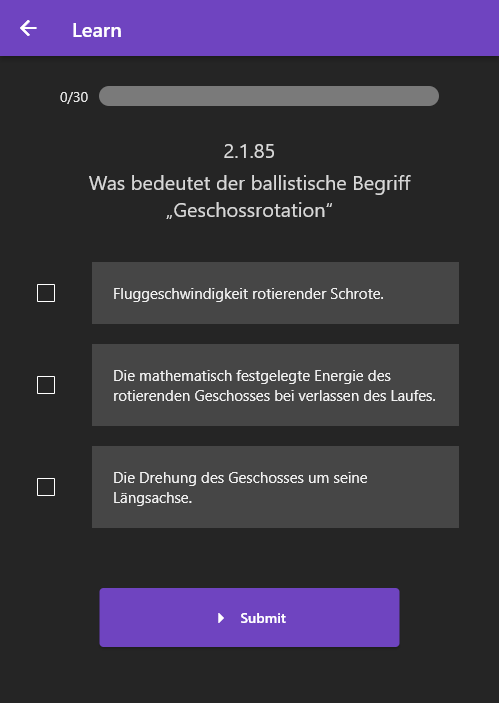
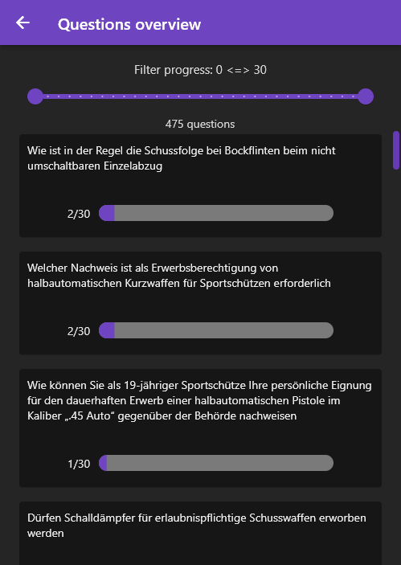

# Waffensachkunde learning app

Simple learning app for the waffensachkunde (Stand: 22.03.2022).

Every correct answer progresses your question by 1, up to 30. Every wrong answer decreases your question progress by 1 (clamped to 0).

Questions are either shown least-progressed first (Leitner system) or at random.

